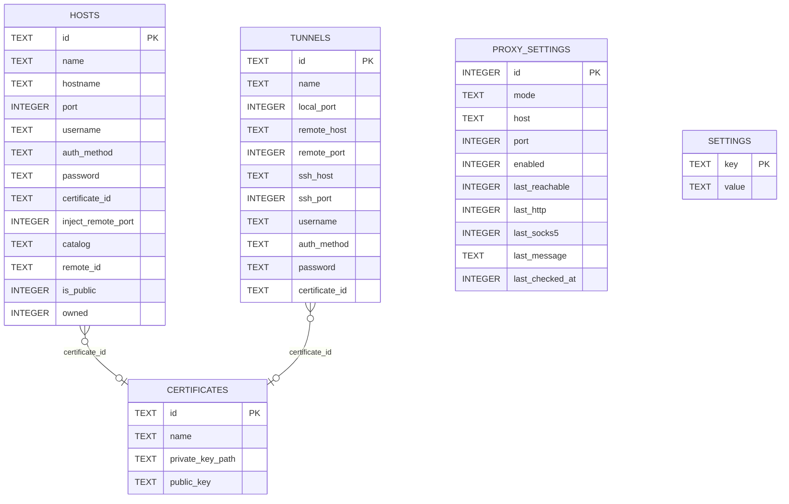
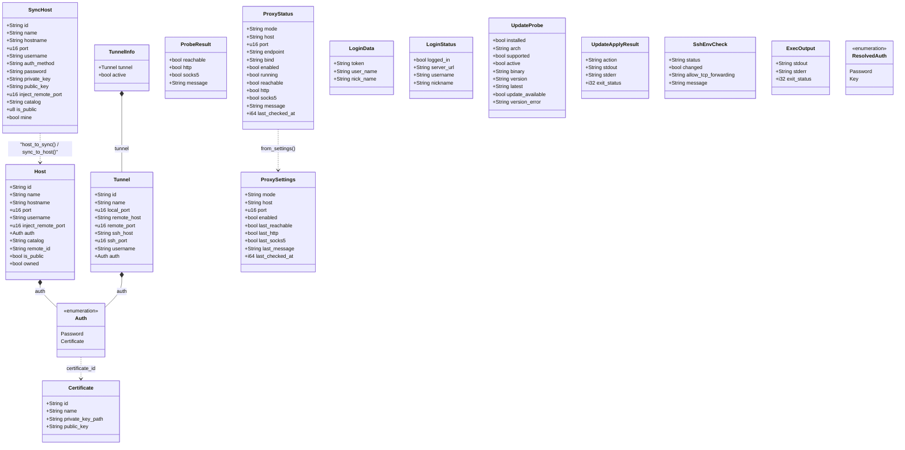
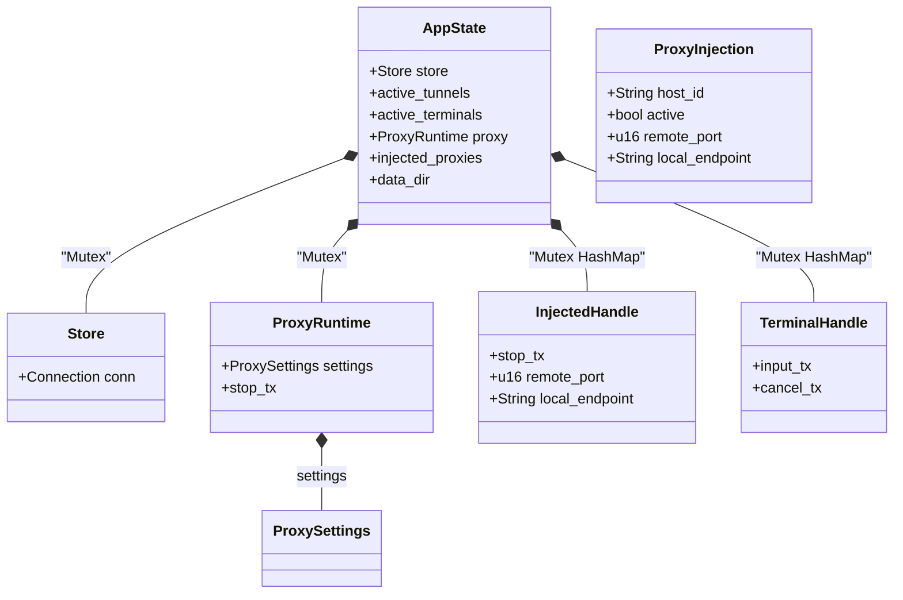

# Cangling Keeper

A local desktop application built with **Rust + Tauri v2**, targeting
**Windows** and **Linux**. It manages a list of remote hosts and lets you run
commands over SSH with one click.

## Features

- Define, edit, and delete SSH hosts (name, hostname/IP, port, username, password).
- Select a host and run a command over SSH, showing stdout/stderr/exit status.
- Define SSH local port-forward tunnels (`ssh -N -L ...`) — paste an SSH command
  to auto-fill the form, or fill the fields manually.
- Connect/disconnect tunnels; the list shows live connection state.
- Tunnel auth via password or an ed25519 key pair (generate one in-app).
- 软件仓库：可管理多个软件集（缺省包含维护中心 Manifest 集 `np4`，以及 Git 仓库 `cangling-repo`）。软件集分为两种：向维护中心查询 manifest 后按哈希下载，或自定义 Git 仓库 clone/pull。同步大文件时显示下载/克隆进度，并可浏览目录与文本文件内容。
- 主机面板可将本地已拉取的软件同步到 Master 主机上 cangling-update 的 `repo/<软件集>/` 目录（按软件集名分目录，避免同名覆盖）。已存在且大小、SHA-256 都相同的文件会跳过，避免 `version.txt` 这类等长变更被漏传。
- 集群管理：SSH 探测该主机 cangling-update 的实际监听端口后，用主机地址 + 服务端口直接打开 `/console`（`install-service` 后端口变化也会跟上；探测不到时缺省 5400）。
- Hosts and tunnels persist to a SQLite database in the app data directory.

> **Security note (current state):** passwords are stored in plain text in the
> local SQLite database, and SSH host keys are not yet verified
> (trust-on-first-use is a planned improvement). Treat this as a local tool on a
> trusted machine for now.

## Data model

### SQLite schema

Stored in `<app_data_dir>/data.sql`. Authentication is denormalized per row
(`auth_method` + `password` + `certificate_id`); `certificate_id` is only set
when `auth_method = 'certificate'` and references `certificates.id` (a logical
foreign key, not enforced by SQLite). `hosts.remote_id` is the server-side host
id used for sync.



- `proxy_settings` is a singleton row (`id = 1`).
- `settings` is a generic key/value store (server URL, login token, username,
  nickname).

### Rust structs

Core domain and DTO structs (see `src/host.rs`, `src/auth.rs`,
`src/certificate.rs`, `src/tunnel.rs`, `src/proxy.rs`, `src/sync.rs`,
`src/host_actions.rs`, `src/ssh.rs`).



Enum variants carry data:

- `Auth::Password { password }`, `Auth::Certificate { certificate_id }`
- `ResolvedAuth::Password(String)`, `ResolvedAuth::Key(String)`

### Runtime state (managed by Tauri)



- `AppState` is the shared Tauri managed state; the maps and handles are guarded
  by `Mutex` and hold tokio `oneshot`/`mpsc` senders used to cancel active
  tunnels, terminals and proxy injections.

## Project structure

```
cangling-keeper/
├── Cargo.toml              # Rust crate + Tauri dependencies
├── build.rs                # Tauri build script
├── tauri.conf.json         # Tauri v2 configuration
├── capabilities/           # Tauri v2 capability (permission) files
│   └── default.json
├── icons/                  # App icons (window + bundle)
├── src/
│   ├── main.rs             # Entry point
│   ├── lib.rs              # Tauri app + #[tauri::command] handlers
│   ├── host.rs             # Host model
│   ├── tunnel.rs           # Tunnel model + SSH command parsing
│   ├── store.rs            # SQLite persistence (hosts + tunnels)
│   ├── repo.rs             # 软件仓库：软件集 manifest 同步 + 目录/文件浏览
│   └── ssh.rs              # SSH exec, port forwarding, key generation (russh)
└── ui/                     # Frontend (plain HTML/CSS/JS, no bundler)
    ├── index.html
    ├── styles.css
    └── main.js
```

The frontend is intentionally dependency-free. `withGlobalTauri` is enabled in
`tauri.conf.json`, so JavaScript can call Rust commands via
`window.__TAURI__.core.invoke(...)` without npm or a bundler.

SSH is implemented with [`russh`](https://crates.io/crates/russh) (pure-Rust,
async) using its `ring` crypto backend, which avoids OpenSSL/libssh2 C
dependencies and needs no extra system libraries beyond a C compiler.

## Prerequisites

### Both platforms

- [Rust](https://rustup.rs) (stable toolchain)
- [Tauri CLI](https://v2.tauri.app/reference/cli/):

  ```sh
  cargo install tauri-cli --version "^2" --locked
  ```

### Linux (Debian/Ubuntu)

#### Build dependencies (compile-time only)

These are required only to *build* the app (headers + toolchain). End users do
not need them:

```sh
sudo apt update
sudo apt install libwebkit2gtk-4.1-dev \
  build-essential \
  curl \
  wget \
  file \
  libxdo-dev \
  libssl-dev \
  libayatana-appindicator3-dev \
  librsvg2-dev
```

#### Runtime dependencies (needed to run the binary)

The compiled binary dynamically links against these shared libraries. Installing
the `-dev` packages above pulls them in automatically on a dev machine, but end
users need the runtime (non-`-dev`) versions:

| Build-time (`-dev`)             | Runtime (end users)         |
| ------------------------------- | --------------------------- |
| `libwebkit2gtk-4.1-dev`         | `libwebkit2gtk-4.1-0`       |
| `libxdo-dev`                    | `libxdo3`                   |
| `libssl-dev`                    | `libssl3`                   |
| `librsvg2-dev`                  | `librsvg2-2`                |
| `libayatana-appindicator3-dev`  | `libayatana-appindicator3-1` |

When distributing as a `.deb`, Tauri declares these runtime dependencies
automatically so `apt` installs them for the user.

(For other distros see https://v2.tauri.app/start/prerequisites/)

### Windows

- Microsoft Visual Studio **C++ Build Tools** with the "Desktop development
  with C++" workload (MSVC).
- Rust **MSVC** toolchain (`rustup default stable-msvc`).
- WebView2 runtime — preinstalled on Windows 10/11, no action needed.

## Run (development)

```sh
cargo tauri dev
```

This opens the window and serves `ui/` with hot reload.

## Build a release bundle

```sh
cargo tauri build
```

Bundles are written to `target/release/bundle/`:

- Windows: `.msi` / `.exe` (NSIS)
- Linux: `.deb`, `.rpm`, and/or AppImage

## Adding commands

1. Add a function in `src/lib.rs` (or a module) and mark it with `#[tauri::command]`.
2. Register it in `.invoke_handler(tauri::generate_handler![...])`.
3. Call it from `ui/main.js` with `window.__TAURI__.core.invoke("name", { args })`
   (argument names use camelCase, e.g. Rust `host_id` → JS `hostId`).

### Data location

Hosts and tunnels are stored in a SQLite database at
`<app_data_dir>/data.sql`, where `<app_data_dir>` is the platform's per-user
application data directory:

- **Linux:** `~/.local/share/cn.cangling.keeper/`
- **Windows:** `%APPDATA%\cn.cangling.keeper\`
- **macOS:** `~/Library/Application Support/cn.cangling.keeper/`

Generated SSH keys are written to `<app_data_dir>/keys/`. The directory is
created automatically on first launch.

Older builds stored data in `./config/` relative to the working directory.
That directory is migrated into the data directory automatically on first
launch, if the data directory does not already contain a database.
